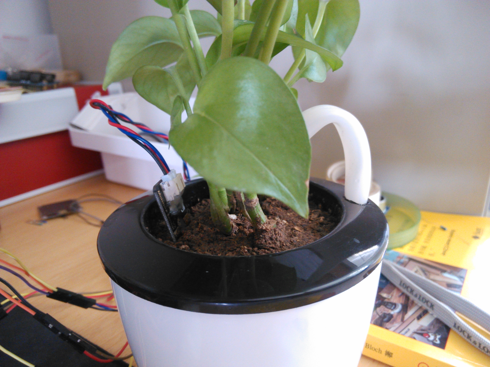
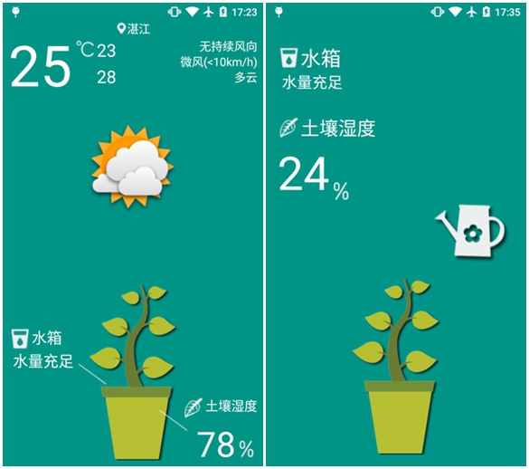

# Smart-pot
>一款基于Arduino的智能花盆系统，实现对盆栽植物的自动浇水，并且上传数据到Yeelink物联网平台，手机端可以随时查看盆栽植物当前环境温度、土壤湿度、水箱水量和获取天气信息，及时为盆栽做出适合天气的放置，并且可以手机控制浇水。系统的设计分成三个部分：对盆栽的植物的土壤湿度、环境温度进行检测和水泵的控制；网络模块对盆栽环境数据的上传；手机端（Android）对盆栽植物相关数据的查看和控制浇水系统。系统的主控为一块称为Arduino Uno的控制板，环境温度的监测主要以传感器DHT11实现，将监测到的空气温度数据传送给控制板，将其上传到物联网平台。土壤湿度监测完成后，将其上传到物联网平台并判断盆栽植物是否需要浇水，控制水泵的工作。Android手机软件查看服务器返回的数据，及时做出应对和控制浇水系统。



## Arduino Uno


## Android App



## Contact

email: temoa_yui@163.com<p>
weibo: [Tem0a_](http://weibo.com/lailaizuiaiyiyi/profile?rightmod=1&wvr=6&mod=personinfo)<p>

## License

```
Copyright 2016 Temoa

Licensed under the Apache License, Version 2.0 (the "License");
you may not use this file except in compliance with the License.
You may obtain a copy of the License at

   http://www.apache.org/licenses/LICENSE-2.0

Unless required by applicable law or agreed to in writing, software
distributed under the License is distributed on an "AS IS" BASIS,
WITHOUT WARRANTIES OR CONDITIONS OF ANY KIND, either express or implied.
See the License for the specific language governing permissions and
limitations under the License.
```
